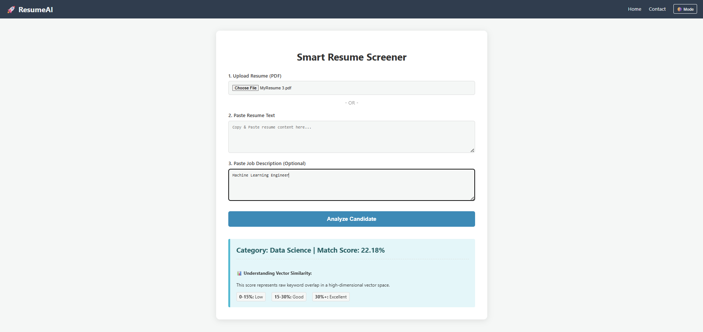

# 🚀 VectorCV AI - Resume Screener & Job Matcher

[](https://vectorcv-ai.onrender.com/)
[](https://www.python.org/)
[](https://flask.palletsprojects.com/)
[](https://scikit-learn.org/)

An intelligent AI-powered resume screening system that automatically categorizes resumes into professional domains and calculates job match scores using advanced machine learning techniques.

## 🌟 Live Demo

**Try it now:** [https://vectorcv-ai.onrender.com/](https://vectorcv-ai.onrender.com/)

## 📸 Screenshots

### Home Page


### Resume Analysis & Prediction


## ✨ Key Features

- **🎯 Resume Classification**: Automatically categorizes resumes into 25+ professional categories with 98% accuracy
- **📊 Job Match Scoring**: Calculates relevance percentage against job descriptions using cosine similarity
- **📄 PDF Processing**: Seamless text extraction from uploaded PDF resumes
- **🌙 Dark Mode**: Modern UI with dark/light theme toggle
- **📱 Responsive Design**: Works perfectly on desktop and mobile devices
- **⚡ Fast Processing**: Sub-second inference time for instant results

## 🛠️ Technology Stack

| Component | Technology | Version |
|-----------|------------|---------|
| **Backend** | Python | 3.9+ |
| **Web Framework** | Flask | 3.1.2 |
| **ML Framework** | Scikit-Learn | 1.8.0 |
| **Vectorization** | TF-IDF | 3000 features |
| **Algorithm** | KNN + OneVsRest | - |
| **PDF Processing** | PyPDF2 | 3.0.1 |
| **Data Processing** | Pandas, NumPy | - |
| **Deployment** | Render | Gunicorn |

## 📂 Project Architecture

```
VectorCV-AI/
│
├── 📦 artifacts/              # ML model artifacts
│   ├── model.pkl             # Trained classifier
│   ├── preprocessor.pkl      # TF-IDF vectorizer
│   └── label_encoder.pkl     # Category encoder
│
├── 🔧 src/                    # Source code
│   ├── components/            # ML pipeline components
│   │   ├── data_ingestion.py      # Data loading & splitting
│   │   ├── data_transformation.py # Text preprocessing
│   │   └── model_trainer.py       # Model training
│   ├── pipeline/              # Orchestration
│   │   ├── predict_pipeline.py    # Inference pipeline
│   │   └── train_pipeline.py      # Training pipeline
│   └── utils.py               # Helper functions
│
├── 🎨 templates/              # HTML templates
│   ├── home.html              # Main application UI
│   └── contact.html           # Contact page
│
├── 📊 notebooks/              # Jupyter notebooks
│   ├── 1_EDA.ipynb           # Exploratory data analysis
│   └── 2_Model_Train.ipynb   # Model development
│
├── 🖼️ images/                 # Screenshots & assets
├── 📋 app.py                  # Flask application
├── 📝 requirements.txt        # Dependencies
└── ⚙️ Procfile               # Deployment config
```

## 🚀 Quick Start

### Prerequisites
- Python 3.9 or higher
- pip package manager

### Installation

1. **Clone the repository**
   ```bash
   git clone https://github.com/debarnabdas007/RESUME-Screener.git
   cd RESUME-Screener
   ```

2. **Create virtual environment**
   ```bash
   python -m venv venv
   source venv/bin/activate  # On Windows: venv\Scripts\activate
   ```

3. **Install dependencies**
   ```bash
   pip install -r requirements.txt
   ```

4. **Run the application**
   ```bash
   python app.py
   ```

5. **Open in browser**
   ```
   http://localhost:5000
   ```

## 📖 Usage

### Web Interface
1. Navigate to the home page
2. Upload a resume PDF or paste resume text
3. Optionally add a job description for match scoring
4. Click "Analyze Resume" to get results

### Programmatic Usage
```python
from src.pipeline.predict_pipeline import PredictPipeline

pipeline = PredictPipeline()
category, match_score = pipeline.predict(resume_text, job_description)

print(f"Category: {category}")
print(f"Match Score: {match_score}%")
```

## 🎯 How It Works

### Resume Classification Pipeline
```
Resume Input → Text Extraction → Cleaning → TF-IDF Vectorization → KNN Classification → Category Output
```

### Job Match Scoring
```
Resume + Job Description → Text Cleaning → Vectorization → Cosine Similarity → Match Percentage
```

### Match Score Interpretation
- **> 30%**: Excellent match - High technical keyword overlap
- **15-30%**: Good match - Relevant experience found
- **< 15%**: Low match - Domain or vocabulary mismatch

## 📊 Model Performance

- **Accuracy**: 98% on test dataset
- **Categories**: 25+ professional domains
- **Features**: 3000 TF-IDF features
- **Algorithm**: K-Nearest Neighbors with One-vs-Rest
- **Inference Time**: < 1 second

## 🤝 Contributing

1. Fork the repository
2. Create a feature branch (`git checkout -b feature/amazing-feature`)
3. Commit your changes (`git commit -m 'Add amazing feature'`)
4. Push to the branch (`git push origin feature/amazing-feature`)
5. Open a Pull Request

## 📝 License

This project is licensed under the MIT License - see the [LICENSE](LICENSE) file for details.

## 🙏 Acknowledgments

- **Dataset**: Updated Resume Dataset (Kaggle)
- **ML Framework**: Scikit-Learn community
- **Web Framework**: Flask framework
- **Deployment**: Render hosting platform

## 📞 Contact

**Developer**: Debarnab Das
- **GitHub**: [@debarnabdas007](https://github.com/debarnabdas007)
- **Live Demo**: [VectorCV AI](https://vectorcv-ai.onrender.com/)

---

**⭐ Star this repository if you found it helpful!**
